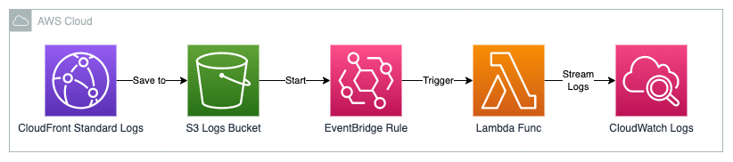

# Log Forwarder

Stream AWS CloudFront standard logs that are stored in S3 into AWS CloudWatch
Logs.



This service involves the following steps for each CloudFront Distribution in
the config list:

1. Create CloudFront Custom Resource to get the Logging configuration.

1. Create the CloudWatch log group.

1. Create IAM Role with the relevant permission to access S3 and write logs to
   CloudWatch.

1. Create the Lambda Function with the necessary logic to extract the logs and
   send it to CloudWatch.

1. Attach the IAM Role to the Lambda Function.

1. Create EventBridge Rule for notification between S3 Bucket and Lambda
   Function.

## Requirement

As CloudFront Distribution configuration is part of another service. To deploy
this service is required to enable and configure the `Standard Logs` before.

Add the desired Distribution IDs for each environment on the config files:

- `config/development.ts`
- `config/production.ts`

```typescript
export const developmentConfig: Config = {
  distributionIdList: ['XXXXXXXXXXXXX', 'XXXXXXXXXXXXX'],
  cdkStackProps: {
    env: {
      account: '000000000000',
      region: 'ap-southeast-2'
    },
    tags
  }
};
```

## Useful Commands

- `yarn install` install packages
- `yarn upgrade-interactive` easy way to update outdated packages
- `yarn format` formats all files supported by Prettier in the current directory
  and its subdirectories
- `yarn test` perform the jest unit tests
- `yarn clean` clean up yarn caches, remove node_modules and yarn.lock
- `yarn cdk diff` compare deployed stack with current state
- `yarn cdk synth` emits the synthesized CloudFormation template
